# 离线识别

## 涉及工具

### muggle_ocr

#### 安装库

```
pip install muggle-ocr
pip install -i http://mirrors.aliyun.com/pypi/simple/ --trusted-host mirrors.aliyun.com muggle-ocr
```
貌似官方仓库已删除

下载[muggle-ocr-1.0.3.tar.gz](./attachment/muggle-ocr-1.0.3.tar.gz)

```
pip install muggle-ocr-1.0.3.tar.gz
```

#### 部署web接口

[20142995/muggle_ocr_flask](https://github.com/20142995/muggle_ocr_flask)

### [sml2h3/ddddocr](https://github.com/sml2h3/ddddocr)

#### 安装库

```
pip install ddddocr
```

#### 部署web接口

[sml2h3/ocr_api_server](https://github.com/sml2h3/ocr_api_server)

### [xiaridenuanfeng/Tools](https://github.com/xiaridenuanfeng/Tools)

未开源，windows下web接口

## 光学印刷文本

```
# muggle_ocr
import muggle_ocr
sdk = muggle_ocr.SDK(model_type=muggle_ocr.ModelType.OCR)
with open(r"test1.png", "rb") as f:
 b = f.read()
text = sdk.predict(image_bytes=b)
print(text)
```

## 4-6位英数验证码识别

### muggle_ocr

```
#  muggle_ocr

import muggle_ocr
# ModelType.Captcha 可识别4-6位验证码
sdk = muggle_ocr.SDK(model_type=muggle_ocr.ModelType.Captcha)
with open(r"test1.png", "rb") as f:
 b = f.read()
text = sdk.predict(image_bytes=b)
print(text)
```
```
# muggle-ocr/ muggle_ocr_flask

import requests
import base64
url = "http://127.0.0.1:5000/muggle_ocr/captcha"
r = requests.post(url,data=base64.b64encode(open('1.png','rb').read()).decode())
print(r.text)
```
### ddddocr

在1.2.0开始，ddddocr的识别部分进行了一次beta更新，主要更新在于网络结构主体的升级，其训练数据并没有发生过多的改变，所以理论上在识别结果上，原先可能识别效果的很好的图形在1.2.0上有一小部分概率会有一定程度的下降，也有可能原本识别不好的图形在1.2.0之后效果却变得特别好。 测试代码：

```
import ddddocr

ocr = ddddocr.DdddOcr()

with open("test.jpg", 'rb') as f:
    image = f.read()

res = ocr.classification(image)
print(res)
```


通过在初始化ddddocr的时候使用beta参数即可快速切换新模型

```
import ddddocr

ocr = ddddocr.DdddOcr(beta=True)

with open("test.jpg", 'rb') as f:
    image = f.read()

res = ocr.classification(image)
print(res)
```

[](https://camo.githubusercontent.com/09f92e1cc1c78a68e0874e68c0995941ea62d1ec6bdbc9457487ee9d193667b5/68747470733a2f2f63646e2e77656e616e7a68652e636f6d2f696d672f32303231303731353231313733333835352e706e67) [](https://camo.githubusercontent.com/9a0ae87e85a93af03b93fa6e518f1ad8e81276114a023735b303355de82627c1/68747470733a2f2f63646e2e77656e616e7a68652e636f6d2f696d672f37386237663537642d333731642d346236352d616662322d6431393630386165313839322e706e67) [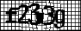](https://camo.githubusercontent.com/739e00a117a1fd6ebe76c55360b3c4738909da0dec82e3bdfbb29d22931fe4ea/68747470733a2f2f63646e2e77656e616e7a68652e636f6d2f696d672f2545352542452541452545342542462541312545352539422542452545372538392538375f32303231313232363134323330352e706e67) [](https://camo.githubusercontent.com/f24236281469eb8d791cfaa7769af05373c54c4f8f878ce2d96e1da84ec11e70/68747470733a2f2f63646e2e77656e616e7a68652e636f6d2f696d672f2545352542452541452545342542462541312545352539422542452545372538392538375f32303231313232363134323332352e706e67) [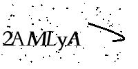](https://camo.githubusercontent.com/3d87a4a708d454e04824c599be0d4e2063fc508274d9b943a70632477642eda7/68747470733a2f2f63646e2e77656e616e7a68652e636f6d2f696d672f32414d4c79415f66643833653166313830306538323930333334313761653664643065306165302e706e67) [](https://camo.githubusercontent.com/6f28990ceb14c88aa554496f5d675b2d82bd3ca877f55c4b5c8b80bfa3a7e03c/68747470733a2f2f63646e2e77656e616e7a68652e636f6d2f696d672f616162645f31383161653831646435353236623862383966393837643131373932363663652e6a7067) [](https://camo.githubusercontent.com/4300486ed8b0658a0af98fc2529e993909207b8691a82de498870ea374380027/68747470733a2f2f63646e2e77656e616e7a68652e636f6d2f696d672f326267687a5f62353034653966396465316564373037303130326432316336343831653063662e706e67) [](https://camo.githubusercontent.com/27d570b9be420de97532da121e87acf386d1053873caa68b331575495b525be4/68747470733a2f2f63646e2e77656e616e7a68652e636f6d2f696d672f303030305f7a3465636332703635727863363130782e6a7067) [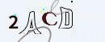](https://camo.githubusercontent.com/2765c848ed46c07aae8ba2c185dc04156115f50064b9c8fd4e69632a6d294c44/68747470733a2f2f63646e2e77656e616e7a68652e636f6d2f696d672f326163645f30353836623662333638353861346538613939333964623861376563303762372e6a7067) [](https://camo.githubusercontent.com/94f6c3ab2d6f77297ba988f19ef067ca41e24d688f9fd7c31068956bfa4f6959/68747470733a2f2f63646e2e77656e616e7a68652e636f6d2f696d672f326138725f37393037346533313164353733643331653136333039373866653034623939302e6a7067) [](https://camo.githubusercontent.com/b998bcc830aeb91c471f1a626edce272ff474502b75b3a538f516263b9b5cbf8/68747470733a2f2f63646e2e77656e616e7a68652e636f6d2f696d672f616674665f433276485a6c6b38353430793371416d434d2e626d70)

```
# ddddocr / ocr_api_server

resp = requests.post("http://{host}:{port}/ocr/file", files={'image': image_bytes})
resp = requests.post("http://{host}:{port}/ocr/b64/text", data=base64.b64encode(file).decode())
```

### xiaridenuanfeng/Tools

```
import os
import requests
import base64
path = 'test/文字验证码'


def xiaridenuanfeng_Tools(file):

    length = len(os.path.splitext(os.path.basename(file))[0])
    base64_data = base64.b64encode(open(file, 'rb').read()).decode("utf8")
    r = requests.get(
        f'http://127.0.0.1:8888/aqwj/?code={base64_data}&length={length}')
    print(os.path.basename(file), r.text)


for file in os.listdir(path):
    full_file = os.path.join(path, file)
    xiaridenuanfeng_Tools(full_file)

```

```
2a8r.jpeg code:2a8r
2acd.jpeg code:2acd
2amlya.png 识别失败
2bghz.png code:2bghz
6k9d.jpeg code:6k9d
8a62n1.png 识别失败
aabd.jpeg code:aabd
aftf.bmp code:aftf
f2339.png 识别失败
jepy.png code:jepv
```


## 滑块验证码

### ddddocr

#### 算法1

小滑块为单独的png图片，背景是透明图，如下图

[](https://camo.githubusercontent.com/4041f9ad1b8493fe8fb0ac296e9be66b315cd94f297ff00020924492a64ff83a/68747470733a2f2f63646e2e77656e616e7a68652e636f6d2f696d672f622e706e67)

然后背景为带小滑块坑位的，如下图

[](https://camo.githubusercontent.com/5f1d6c9cefe21a871e6f768ff5f4e885bc3ded260f3fbae82f332709b7f0ea70/68747470733a2f2f63646e2e77656e616e7a68652e636f6d2f696d672f612e706e67)

```
  det = ddddocr.DdddOcr(det=False, ocr=False)
  
  with open('target.png', 'rb') as f:
      target_bytes = f.read()
  
  with open('background.png', 'rb') as f:
      background_bytes = f.read()
  
  res = det.slide_match(target_bytes, background_bytes)
  
  print(res)
```


*提示：如果小图无过多背景部分，则可以添加simple_target参数， 通常为jpg或者bmp格式的图片*

```
    slide = ddddocr.DdddOcr(det=False, ocr=False)
    
    with open('target.jpg', 'rb') as f:
        target_bytes = f.read()
    
    with open('background.jpg', 'rb') as f:
        background_bytes = f.read()
    
    res = slide.slide_match(target_bytes, background_bytes, simple_target=True)
    
    print(res)
```


#### 算法2

一张图为带坑位的原图，如下图

[](https://camo.githubusercontent.com/3e3a6fd355f83ce97d200fca7c90ef8493027e32b7cdc5eacc08c24c47ddf2e2/68747470733a2f2f63646e2e77656e616e7a68652e636f6d2f696d672f62672e6a7067)

一张图为原图，如下图

[](https://camo.githubusercontent.com/33f00ee6ae9752e0575034932a0a5b58dbc02065384256d8d3d976e0d806c1b9/68747470733a2f2f63646e2e77656e616e7a68652e636f6d2f696d672f66756c6c706167652e6a7067)

```
  slide = ddddocr.DdddOcr(det=False, ocr=False)

  with open('bg.jpg', 'rb') as f:
      target_bytes = f.read()
  
  with open('fullpage.jpg', 'rb') as f:
      background_bytes = f.read()
  
  img = cv2.imread("bg.jpg")
  
  res = slide.slide_comparison(target_bytes, background_bytes)

  print(res)
```

```

 det = ddddocr.DdddOcr(det=False, ocr=False)
  
  with open('target.png', 'rb') as f:
      target_bytes = f.read()
  
  with open('background.png', 'rb') as f:
      background_bytes = f.read()
  
  res = det.slide_match(target_bytes, background_bytes)
  
  print(res)
```

## 点选验证码

### ddddocr

```
import ddddocr
import cv2

det = ddddocr.DdddOcr(det=True)

with open("test.jpg", 'rb') as f:
    image = f.read()

poses = det.detection(image)
print(poses)

im = cv2.imread("test.jpg")

for box in poses:
    x1, y1, x2, y2 = box
    im = cv2.rectangle(im, (x1, y1), (x2, y2), color=(0, 0, 255), thickness=2)

cv2.imwrite("result.jpg", im)
```


举些例子：

[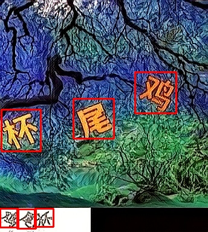](https://camo.githubusercontent.com/cc3549325aa04e7243c44c7e69092f35d567af0041d5cb3400a79614162a6b7b/68747470733a2f2f63646e2e77656e616e7a68652e636f6d2f696d672f70616765315f312e6a7067) [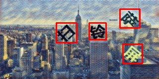](https://camo.githubusercontent.com/11dadab5ee938b7ca2b2048a5309f30ace839801947bfc70e1ecffe13fe3db59/68747470733a2f2f63646e2e77656e616e7a68652e636f6d2f696d672f70616765315f322e6a7067) [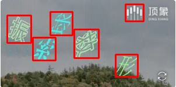](https://camo.githubusercontent.com/3a304aa072093c389a4fbe6c0b9e50f76935616d9525cc3ea412d267368373ab/68747470733a2f2f63646e2e77656e616e7a68652e636f6d2f696d672f70616765315f332e6a7067) [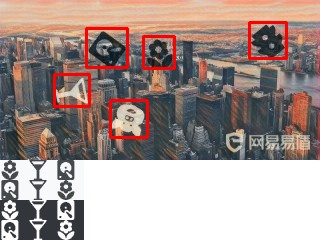](https://camo.githubusercontent.com/5ef9819ddef33fa0f4ba3c5912a863418710f884479f87e5f00ce7c1b1e40377/68747470733a2f2f63646e2e77656e616e7a68652e636f6d2f696d672f70616765315f342e6a7067) [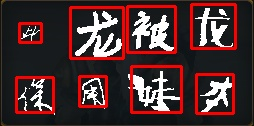](https://camo.githubusercontent.com/7bcbdc83e6cdf654eb5bfdf728626e83bb18d8de324ca41299465d947392ea2d/68747470733a2f2f63646e2e77656e616e7a68652e636f6d2f696d672f726573756c742e6a7067) [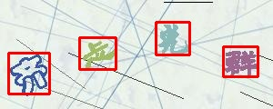](https://camo.githubusercontent.com/496b1d5ab4be31a1c74eaa7d22654680a3d0b7d053417707fb0eddc719d8faa1/68747470733a2f2f63646e2e77656e616e7a68652e636f6d2f696d672f726573756c74322e6a7067) [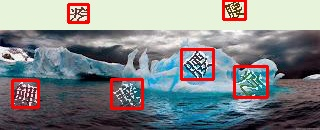](https://camo.githubusercontent.com/7b0bcc252963e8b5aa6fba4ceef930ea04ed41290d0e1694e4589af1288591a9/68747470733a2f2f63646e2e77656e616e7a68652e636f6d2f696d672f726573756c74342e6a7067)

# 在线识别

## 涉及网站

### [yescaptcha.com](https://yescaptcha.com)

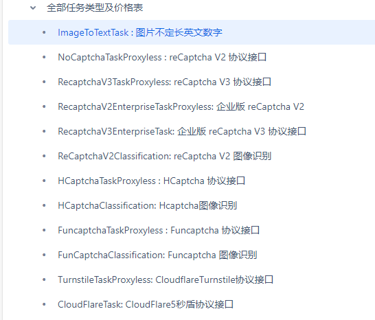


### [ttshitu.com](http://www.ttshitu.com/)

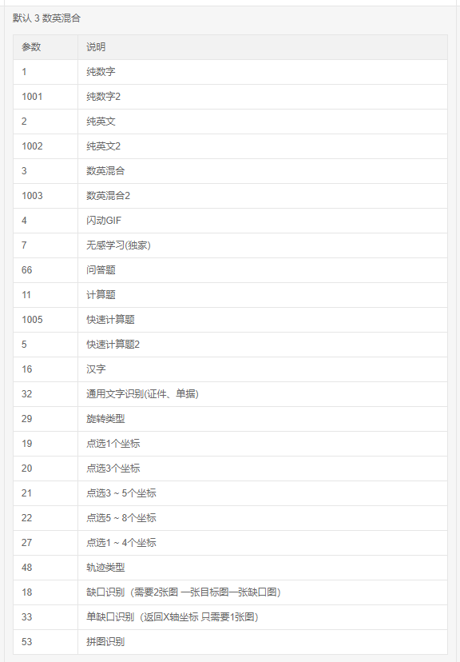

## 文字验证码

### yescaptcha.com

```
import sys
sys.path.append(".")

import base64
import requests


with open("ocr/文字验证码/8we1.png", 'rb') as f:
    image = f.read()

image = base64.b64encode(image)
image = str(image, 'utf8')

data = {
    "clientKey":"xxxxxxxxxxxxxxxxxxxxxxxxxxxxxxxxxxxxxxx",
    "task":
    {
        "type": "ImageToTextTaskTest",
        "body": image # base64编码后的图片
    }
}
r = requests.post("https://api.yescaptcha.com/createTask", json=data).json()
print(r)
```

```
{'errorId': 0, 'errorCode': '', 'status': 'ready', 'solution': {'text': '8we1'}, 'taskId': '1fb204c2-d8d7-11ec-9dc6-8a3e9a7e9eea'}

```

### ttshitu.com

```
import base64
import json
import requests
# 一、图片文字类型(默认 3 数英混合)：
# 1 : 纯数字
# 1001：纯数字2
# 2 : 纯英文
# 1002：纯英文2
# 3 : 数英混合
# 1003：数英混合2
#  4 : 闪动GIF
# 7 : 无感学习(独家)
# 11 : 计算题
# 1005:  快速计算题
# 16 : 汉字
# 32 : 通用文字识别(证件、单据)
# 66:  问答题
# 49 :recaptcha图片识别
# 二、图片旋转角度类型：
# 29 :  旋转类型
#
# 三、图片坐标点选类型：
# 19 :  1个坐标
# 20 :  3个坐标
# 21 :  3 ~ 5个坐标
# 22 :  5 ~ 8个坐标
# 27 :  1 ~ 4个坐标
# 48 : 轨迹类型
#
# 四、缺口识别
# 18 : 缺口识别（需要2张图 一张目标图一张缺口图）
# 33 : 单缺口识别（返回X轴坐标 只需要1张图）
# 五、拼图识别
# 53：拼图识别
def base64_api(uname, pwd, img, typeid):
    with open(img, 'rb') as f:
        base64_data = base64.b64encode(f.read())
        b64 = base64_data.decode()
    data = {"username": uname, "password": pwd, "typeid": typeid, "image": b64}
    result = json.loads(requests.post("http://api.ttshitu.com/predict", json=data).text)
    if result['success']:
        return result["data"]["result"]
    else:
        #！！！！！！！注意：返回 人工不足等 错误情况 请加逻辑处理防止脚本卡死 继续重新 识别
        return result["message"]
    return ""


if __name__ == "__main__":
    img_path = r"C:\Users\w\Desktop\qnzg.png"
    result = base64_api(uname='', pwd='', img=img_path, typeid=3)
    print(result)
```

